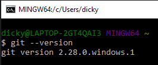
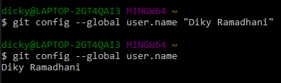
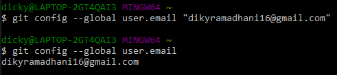
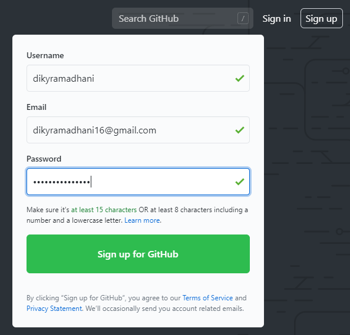
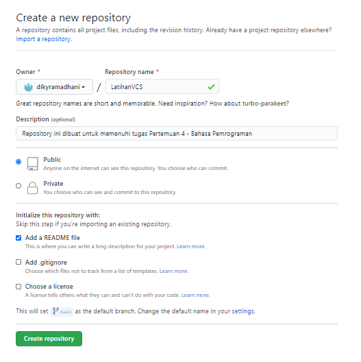
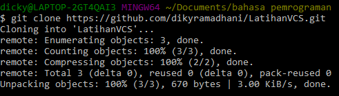
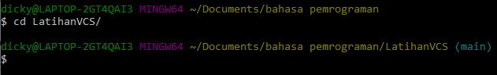
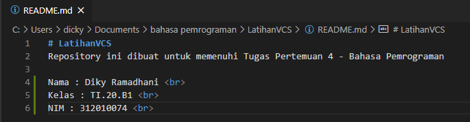
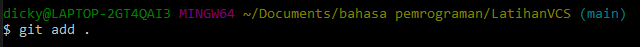
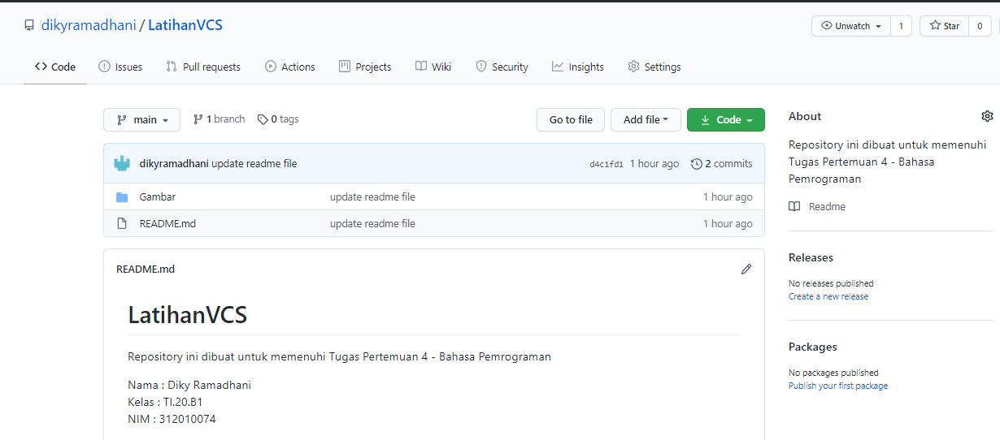

# LatihanVCS
Repository ini dibuat untuk memenuhi Tugas Pertemuan 4 - Bahasa Pemrograman

Nama : Diky Ramadhani  
Kelas : TI.20.B1  
NIM : 312010074  

## Langkah-Langkah Penggunaan Git
* Langkah pertama, silahkan download git pada link berikut : [Klik disini](git-scm.com)
* Setelah file di download, selanjutnya lakukan instalasi dengan referensi berikut : [Panduan Installasi Git](https://git-scm.com/book/en/v2/Getting-Started-Installing-Git)
* Lalu jika installasi telah selesai, buka *software* **GitBash** pada menu di Windows, dan lakukan pengecekan versi,  dengan mengetik syntax berikut :
> git--version  

* Jika muncul tampilan git version, berarti Git sudah berhasil di install dan bisa di gunakan.
Langkah pertama, kita harus mengkonfigurasikan user nama dan email di Git, dengan mengetikkan syntax berikut :
> git config --global user.name "Masukkan Nama Anda disini"  
  
> git config --global user.email "Masukkan Email anda disini"  
  
Setelah diisi, silahkan lakukan pengecekan user nama dan email, dengan mengetikkan perintah berikut :  
> git config --global user.name  
> git config --global user.email  
* Buat akun di [GitHub](github.com) , seperti contoh dibawah. Dan lakukan *Verifikasi* akun melalui email yang sudah terdaftar.

* Jika akun GitHub sudah dibuat dan di verifikasi, Proses selanjutnya silahkan buat *Repository* seperti gambar dibawah ini.  
**Penjelasan :**
> * Repository Name : (Isi nama repository yang diinginkan sesuai selera anda, contohnya seperti saya ingin membuat repository *LatihanVCS*)  
> * Description : (Isi dengan penjelasan tentang repository yang anda buat)  
> * Public / Private : (Pilih salah satu jenis repository akan bisa dilihat oleh semua orang atau tidak)  
> * Add a README.mc file : Centang pada bagian ini jika anda menginginkan file README.md ada di repository anda  
> * Add .gitignore : Merupakan sebuah file yang berisi daftar nama-nama file dan direktori yang akan diabaikan oleh Git  
> * Choose a license : Silahkan centang jika anda memiliki lisensi pada repository yang akan dibuat kemudian tekan tombol **Create Repository** untuk menyimpan  

* Jika repository sudah dibuat maka akan muncul tampilan seperti dibawah ini :

* Pembuatan akun dan repository pada GitHub telah selesai, lalu saat ini kita lakukan untuk *me-remote* repository GitHub pada GitBash Lokal. Caranya adalah, Pertama kita harus menyalin *link URL* git kita di Github, dengan cara tekan tombol *Code* lalu klik *Copy*.
* Setelah *Link URL* git kita tercopy, Selanjutnya silahkan buka File Explorer pada Windows, kemudian pilih folder dimana kita akan *Mendownload* Repository dari GitHub ke lokal. Kemudian Klik Kanan, Pilih **Git Bash Here**.

* *Pop Up* Command Prompt (CMD) akan terbuka. Pada proses ini kita akan melakukan download file repository yang tadi dibuat, dengan mengetikkan *syntax* berikut :
> git clone [URL] Pada contohnya, saya akan memasukkan *git clone*  
> https://github.com/dikyramadhani/LatihanVCS.git  

* Setelah proses cloning selesai, pada saat ini kita masih pada folfer awal (master), kita harus masuk kedalam folder yang telah di cloning tadi. yaitu, *LatihanVCS* dengan mengetikkan *syntax* berikut :
> cd LatihanVCS/  

* Lalu saat ini kita sudah masuk kedalam folder *LatihanVCS*,Silahkan edit file **README.md** yang ada di File Explorer. Bisa menggunakan Text Editor (*Sublime Text, Notepad, Notepad++, Visual Studio Code*). Edit sesuai keinginan anda.
Aturan file .md (Markdown) bisa dilihat di [Link ini](guides.github.com/features/mastering-markdown/)  

Setelah file README.md diedit, silahkan simpan file tersebut dengan cara **CTRL+S** atau **File > Save**
* Langkah selanjutnya setelah file disimpan, kita kembali pada App Git Bash (CMD). Ketik pada Git Bash seperti berikut ini :
> git add  

* Setelah selesai melakukan *git add*. langkah selanjutnya adalah melakukan *commit*. Fungsi commit adalah untuk menyimpan perubahan yang dilakukan, tetapi tidak ada perubahan pada remote repository. Ketik pada App Git Bash seperti berikut ini :
> git commit "Update README.md"

* Semua proses telah selesai, silahkan kembali ke Web Browser untuk melihat perubahan yang telah di *commit* dan *push* dari remote.

## TERIMA KASIH , SEMOGA BERHASIL !

